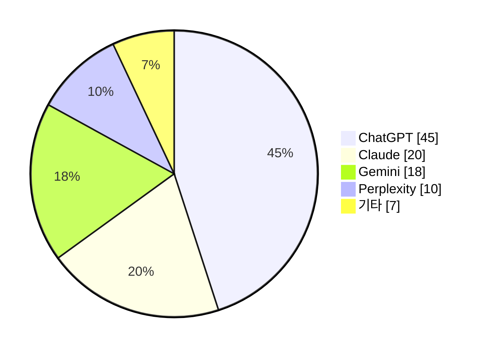
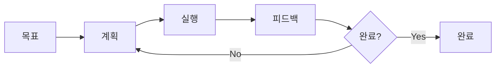

# 2026년 인공지능 트렌드

AI 에이전트 시대의 시작

<div class="absolute bottom-10">
<span class="font-500">
2025.12
</span>
</div>

<!--
안녕하세요, 여러분. 오늘 첫 번째 시간에는 2026년 인공지능 트렌드에 대해서 이야기해 보려고 합니다.

여러분, 혹시 ChatGPT 써보신 분 계세요? 대부분 써보셨을 거예요. 그런데 2024년까지만 해도 "AI = ChatGPT"라는 공식이 성립했었는데, 지금은 상황이 많이 달라졌습니다.
-->

---

# 오늘 알아볼 내용

<div class="mt-8">
<v-clicks>

**1️⃣ ChatGPT 독주 체제의 변화**

- AI 시장이 어떻게 바뀌고 있는가?

**2️⃣ 행동하는 인공지능, AI 에이전트**

- 단순 대화를 넘어 실제로 일하는 AI

**3️⃣ 피지컬 AI의 등장**

- 휴머노이드 로봇과 자율주행

**4️⃣ 내 기기에서 돌아가는 AI**

- 온디바이스 sLLM의 가능성

</v-clicks>
</div>

<!--
오늘 1시간 동안 이 네 가지 주제를 다룰 거예요.

첫 번째는 ChatGPT 독주 체제가 어떻게 무너지고 있는지, 두 번째는 요즘 가장 핫한 키워드인 AI 에이전트, 세 번째는 로봇과 자율주행 같은 피지컬 AI, 마지막으로 여러분의 스마트폰이나 노트북에서 돌아가는 작은 AI 모델에 대해서 알아보겠습니다.
-->

---

## layout: section

# 01

## ChatGPT 독주 체제의 변화

"이제 AI는 하나가 아니다"

<!--
자, 첫 번째 주제입니다.

2022년 11월 ChatGPT가 나왔을 때 기억나시나요? 전 세계가 충격에 빠졌었죠. "AI가 이렇게 말을 잘해?" 하면서요.

그때부터 약 2년간 ChatGPT는 AI의 대명사였습니다. 하지만 2025년, 2026년 들어서 상황이 완전히 달라졌어요.
-->

---

# AI 서비스 사용자 이동 현황

<div class="grid grid-cols-2 gap-8 pt-4">
<div>

<v-clicks>

### 📉 ChatGPT

독점에서 경쟁 체제로

### 📈 경쟁 서비스 급성장

- **Claude** (Anthropic)
- **Gemini** (Google)
- **Perplexity** (검색 특화)

### 📈 중국 오픈소스

- DeepSeek, Qwen 부상

</v-clicks>

</div>
<div class="flex items-center justify-center">



</div>
</div>

<v-click>

> 💡 **핵심**: 더 이상 "AI = ChatGPT"가 아니다

</v-click>

<!--
이 그래프를 보시면요, ChatGPT의 독주 체제가 무너지고 있다는 걸 확실히 알 수 있습니다.

Anthropic의 Claude, Google의 Gemini, 그리고 검색에 특화된 Perplexity 같은 서비스들이 빠르게 성장하고 있어요.

특히 주목할 건 중국이에요. DeepSeek이라는 모델이 나왔는데, 성능은 ChatGPT급인데 오픈소스로 무료 공개됐어요.
-->

---

# 주요 AI 서비스 비교

|     서비스     | 특징             | 강점                         |
| :------------: | ---------------- | ---------------------------- |
|  **ChatGPT**   | 범용 대화형 AI   | 플러그인 생태계, 이미지 생성 |
|   **Claude**   | 안전성 중시 AI   | 긴 문서 처리, 코딩, 분석     |
|   **Gemini**   | 구글 생태계 연동 | 검색 통합, 멀티모달          |
| **Perplexity** | AI 검색 엔진     | 실시간 정보, 출처 제공       |
|  **DeepSeek**  | 오픈소스         | 무료, 커스터마이징 가능      |

<v-click>

<div class="mt-8 p-4 bg-blue-50 rounded-lg dark:bg-blue-900/20">

**🎯 용도에 따른 선택이 중요해졌습니다**

</div>

</v-click>

<!--
ChatGPT는 여러분이 잘 아시죠? 범용적으로 다 잘해요.

Claude는 제가 개인적으로 많이 쓰는 건데요, 긴 문서를 분석하거나 코딩할 때 정말 좋아요.

Gemini는 구글 서비스랑 연동이 잘 돼서, Gmail이나 Drive 쓰시는 분들한테 편해요.

Perplexity는 검색에 특화되어 있어서, "이거 진짜야?" 싶을 때 출처까지 보여줘서 좋습니다.
-->

---

# 이미지 생성 AI의 진화

<div class="grid grid-cols-2 gap-8">
<div>

### 🎨 주요 서비스

<v-clicks>

- **Midjourney** - 예술적 스타일
- **DALL-E 3** - ChatGPT 통합
- **Stable Diffusion** - 오픈소스
- **Adobe Firefly** - 상업적 사용 안전
- **Flux, Ideogram** - 신흥 강자

</v-clicks>

</div>
<div>

### 📸 2023년 vs 2025년

<div class="grid grid-cols-2 gap-2 mt-4">
  <div class="text-center">
    
    <p class="text-xs mt-1 opacity-70">2023년 (어색함)</p>
  </div>
  <div class="text-center">
    
    <p class="text-xs mt-1 opacity-70">2025년 (실사 수준)</p>
  </div>
</div>

</div>
</div>

<v-click>

> 💡 이제 AI로 웬만한 이미지는 다 만든다

</v-click>

<!--
텍스트 AI만 발전한 게 아니에요. 이미지 생성 AI도 엄청나게 좋아졌습니다.

2023년만 해도 AI가 만든 이미지 보면 "어, 이거 AI가 만들었네" 바로 티가 났잖아요? 손가락이 6개라든지...

근데 지금 보세요. 거의 구분이 안 돼요.
-->

---

# 중국발 오픈소스 AI의 충격

<div class="grid grid-cols-2 gap-8">
<div>

### 🇨🇳 DeepSeek R1

<v-clicks>

- GPT-4급 성능을 **오픈소스**로 공개
- 훈련 비용: 기존 대비 **1/10 수준**
- 전 세계 AI 업계에 충격

</v-clicks>

</div>
<div>

### 🇨🇳 Qwen (알리바바)

<v-clicks>

- 다국어 지원 우수
- 한국어 성능도 준수
- 다양한 크기의 모델 제공

</v-clicks>

</div>
</div>

<v-click>

<div class="mt-8 p-4 bg-yellow-50 rounded-lg dark:bg-yellow-900/20">

**💡 시사점**: "AI 기술은 더 이상 미국만의 것이 아니다"

예산이 없어도 오픈소스 모델을 활용하면 AI 도입이 가능

</div>

</v-click>

<!--
특히 주목해야 할 게 중국이에요.

올해 초에 DeepSeek R1이라는 모델이 나왔는데요, GPT-4랑 비슷한 성능인데 오픈소스로 그냥 공개해버렸어요.

더 놀라운 건 훈련 비용이에요. OpenAI가 수천억 원 들여서 만든 걸, DeepSeek은 1/10 비용으로 만들었대요.
-->

---

## layout: statement

# AI 프로바이더는 하나가 아니다

<v-clicks>

✓ ChatGPT가 최고? → **용도에 따라 다르다**

✓ 코딩은 Claude가 더 나을 수 있다

✓ 검색은 Perplexity가 더 정확할 수 있다

✓ 이미지는 Midjourney가 더 예쁠 수 있다

</v-clicks>

<v-click>

<div class="mt-8">

### 🎯 2026년 AI 시대의 핵심 역량

**"용도에 맞는 AI를 선택하는 능력"**

</div>

</v-click>

<!--
자, 첫 번째 섹션을 정리하면요,

이제 AI는 하나만 잘 쓰면 되는 시대가 아닙니다.

마치 목수가 망치만 쓰지 않고, 상황에 따라 드라이버도 쓰고 톱도 쓰듯이, 여러분도 "이 작업에는 어떤 AI가 맞을까?"를 고민할 수 있어야 해요.
-->

---

## layout: section

# 02

## 행동하는 인공지능, AI 에이전트

"대답만 하는 AI는 끝났다"

<!--
두 번째 주제, AI 에이전트입니다.

이게 요즘 AI 업계에서 가장 핫한 키워드예요.

지금까지 ChatGPT 같은 AI는 뭘 했냐면요, 우리가 물어보면 대답해주는 거였어요. "이거 어떻게 해?" 하면 "이렇게 하세요~" 하고 알려주는 거죠.

근데 AI 에이전트는 달라요. "이거 해줘" 하면 진짜로 해요.
-->

---

# AI 에이전트란?

<div class="grid grid-cols-2 gap-12">
<div>

### 🔄 기존 AI (챗봇)

```
질문 → 답변 → 끝
```

**예시**

> "비행기 예약 어떻게 해요?"
>
> → "이렇게 하세요~"

<v-click>

#### 특징: **알려주는 AI**

</v-click>

</div>
<div>

### 🤖 AI 에이전트

<div class="overflow-hidden">



</div>

**예시**

> "비행기 예약해줘"
>
> → (직접 예약 사이트 접속, 검색, 결제까지)

<v-click>

#### 특징: **해주는 AI**

</v-click>

</div>
</div>

<!--
AI 에이전트의 정의를 간단히 설명드리면요,

기존 AI는 여러분이 물어보면 대답해주는 수준이었어요. "비행기 예약 어떻게 해?" 하면 "항공사 사이트 들어가서 날짜 선택하고..." 이렇게 알려주죠.

근데 AI 에이전트는요, "비행기 예약해줘" 하면 진짜로 예약을 해요.
-->

---

# AI 에이전트의 4가지 핵심 능력

<div class="grid grid-cols-2 gap-8">

<v-clicks>

<div class="p-4 bg-blue-50 rounded-lg dark:bg-blue-900/20">

### 🧠 다단계 추론

Multi-step Reasoning

복잡한 작업을 작은 단계로 분해

</div>

<div class="p-4 bg-green-50 rounded-lg dark:bg-green-900/20">

### 🔧 도구 사용

Tool Use

API, 웹브라우저, 앱을 직접 조작

</div>

<div class="p-4 bg-yellow-50 rounded-lg dark:bg-yellow-900/20">

### 🔄 자기 수정

Self-correction

실패하면 다른 방법 시도

</div>

<div class="p-4 bg-purple-50 rounded-lg dark:bg-purple-900/20">

### 💾 기억

Memory

이전 작업 내용을 기억하고 활용

</div>

</v-clicks>

</div>

<!--
AI 에이전트가 이렇게 일을 할 수 있는 건 네 가지 핵심 능력 덕분이에요.

첫째, 다단계 추론이에요. "여행 계획 짜줘"라고 하면, AI가 알아서 "먼저 항공권, 그다음 숙소, 그다음 일정..." 이렇게 단계를 나눠서 생각해요.

둘째, 도구 사용이에요. 브라우저 열고, 버튼 클릭하고, API 호출하고... 이런 걸 직접 해요.
-->

---

# 대표적인 AI 에이전트 서비스

<div class="grid grid-cols-2 gap-6">

<v-clicks>

<div class="p-4 border rounded-lg">

### 🟢 OpenAI Operator

- ChatGPT 기반 에이전트
- 웹 브라우징, 작업 자동화

</div>

<div class="p-4 border rounded-lg">

### 🟣 Claude Computer Use

- Anthropic의 컴퓨터 제어 AI
- 데스크톱 앱까지 조작 가능

</div>

<div class="p-4 border rounded-lg">

### 🔵 Microsoft Copilot Agent

- MS 365 통합 에이전트
- Word, Excel, Outlook 자동화

</div>

<div class="p-4 border rounded-lg">

### 🟠 Salesforce Agentforce

- CRM 특화 에이전트
- 고객 응대 자동화

</div>

</v-clicks>

</div>

<!--
지금 나와 있는 대표적인 AI 에이전트 서비스들을 소개해 드릴게요.

OpenAI는 Operator라는 서비스를 내놨어요. ChatGPT한테 "이거 해줘" 하면 브라우저에서 직접 작업을 해요.

Claude는 Computer Use라는 기능이 있는데, 이건 브라우저뿐 아니라 데스크톱 앱도 조작할 수 있어요.
-->

---

# 🎬 영상으로 보는 AI 에이전트

<div class="grid grid-cols-2 gap-6">
<div>

### 데모 영상

<!-- TODO: 실제 영상 URL로 교체 -->
<div class="relative aspect-video bg-gray-900 rounded-lg overflow-hidden">
  <iframe
    src="https://www.youtube.com/embed/dQw4w9WgXcQ"
    class="absolute inset-0 w-full h-full"
    frameborder="0"
    allow="accelerometer; autoplay; clipboard-write; encrypted-media; gyroscope; picture-in-picture"
    allowfullscreen>
  </iframe>
</div>
<p class="text-xs opacity-60 mt-1">※ 플레이스홀더 - 실제 AI Agent 데모 영상으로 교체 필요</p>

</div>
<div>

### 확인할 수 있는 것들

<v-clicks>

- 에이전트가 직접 브라우저 조작
- 클릭, 스크롤, 타이핑 자동 수행
- 사람의 개입 없이 작업 완료

</v-clicks>

<v-click>

<div class="mt-4 p-3 bg-gray-100 rounded-lg dark:bg-gray-800 text-sm">

**🔍 추천 검색**

- "OpenAI Operator demo"
- "Claude Computer Use demo"

</div>

</v-click>

</div>
</div>

<!--
말로 설명하는 것보다 직접 보시는 게 이해가 빠를 거예요.

보셨죠? AI가 직접 마우스 움직이고, 클릭하고, 타이핑해요. 사람이 하는 것처럼 브라우저를 조작하는 거예요.

예전에는 이런 자동화를 하려면 개발자가 코드를 짜야 했는데, 이제는 그냥 "이거 해줘"라고 말하면 AI가 알아서 해요.
-->

---

## layout: fact

# $1,036억

## (약 140조 원)

2032년 AI 에이전트 시장 전망

<v-click>

연평균 성장률 **45.3%**

</v-click>

<!--
AI 에이전트 시장이 얼마나 커지고 있는지 숫자로 보여드릴게요.

2025년 현재 시장 규모가 약 10조 원이에요. 근데 2032년에는 140조 원까지 커질 거라고 해요. 연평균 45% 성장이에요. 엄청나죠?
-->

---

# AI 에이전트 시장 현황 (2025)

<div class="grid grid-cols-2 gap-8">
<div>

### 📊 시장 규모

<v-clicks>

- 2025년: **$73.8억** (약 10조 원)
- 2032년: **$1,036억** (약 140조 원) 전망
- 연평균 성장률(CAGR): **45.3%**

</v-clicks>

</div>
<div>

### 📈 기업 채택률

<v-clicks>

- **85%** 기업이 최소 1개 워크플로우에 도입
- **80%** 고객 서비스 이슈를 AI가 처리 (2029년 전망)

</v-clicks>

</div>
</div>

<v-click>

<div class="mt-8 p-4 bg-blue-50 rounded-lg dark:bg-blue-900/20">

**🔮 Gartner 전망**: 2026년까지 엔터프라이즈 앱 40%에 AI 에이전트 탑재 (현재 5% 미만)

</div>

</v-click>

<!--
그리고 이미 기업의 85%가 AI 에이전트를 어떤 형태로든 도입했다고 합니다.

Gartner라는 유명한 리서치 회사에서는, 2026년까지 기업용 앱의 40%에 AI 에이전트가 들어갈 거라고 해요. 지금은 5%도 안 되는데 말이죠.
-->

---

# AI 에이전트가 바꿀 업무 방식

<div class="grid grid-cols-2 gap-6">

<v-clicks>

<div class="p-4 bg-blue-50 rounded-lg dark:bg-blue-900/20">

### ✉️ 이메일/일정 관리

> "오늘 받은 메일 중 중요한 것만 정리해줘"
>
> "다음 주 미팅 일정 잡아줘"

</div>

<div class="p-4 bg-green-50 rounded-lg dark:bg-green-900/20">

### 📊 데이터 분석

> "이 엑셀 파일 분석해서 보고서 만들어줘"
>
> "월별 매출 추이 그래프로 보여줘"

</div>

<div class="p-4 bg-yellow-50 rounded-lg dark:bg-yellow-900/20">

### 🔍 리서치

> "우리 경쟁사 최근 동향 조사해줘"
>
> "이 주제로 발표자료 만들어줘"

</div>

<div class="p-4 bg-purple-50 rounded-lg dark:bg-purple-900/20">

### 🛒 예약/구매

> "이번 주말 부산행 KTX 예약해줘"
>
> "회의실 예약하고 참석자들한테 메일 보내줘"

</div>

</v-clicks>

</div>

<!--
그럼 AI 에이전트가 실제로 어떤 업무를 대신해줄 수 있는지 예시를 볼게요.

여러분이 회사에서 하는 반복적인 업무의 상당 부분을 AI 에이전트가 대신할 수 있다는 거예요.
-->

---

## layout: statement

# AI 에이전트 = 나의 디지털 비서

<v-clicks>

✓ 단순 질문-응답을 넘어 **실제 업무 수행**

✓ 2026년, 기업 앱 40%에 에이전트 탑재 전망

✓ 취업 후 만나게 될 **필수 기술**

</v-clicks>

<v-click>

<div class="mt-8">

### 🎯 여러분에게 필요한 것

**"AI 에이전트에게 일을 잘 시키는 능력"**

= 명확한 목표 설정 + 적절한 도구 선택 + 결과 검증

</div>

</v-click>

<!--
AI 에이전트 섹션을 정리하면요,

이제 AI는 여러분의 디지털 비서가 될 거예요. 질문에 대답해주는 수준이 아니라, 실제로 일을 해주는 동료가 되는 거죠.

여러분이 취업하시면 이런 AI 에이전트를 실제로 업무에서 쓰게 될 확률이 매우 높아요.
-->

---

## layout: section

# 03

## 피지컬 AI의 등장

휴머노이드 로봇과 자율주행

"AI가 몸을 갖다"

<!--
세 번째 주제, 피지컬 AI입니다.

지금까지 얘기한 AI는 다 소프트웨어였어요. 화면 안에서만 존재하는 AI죠.

근데 피지컬 AI는 달라요. AI가 실제 몸을 갖고 물리적 세계에서 움직이는 거예요.
-->

---

# 휴머노이드 로봇 주요 기업

<div class="grid grid-cols-4 gap-3">

<v-clicks>

<div class="text-center">
  
  <h4 class="text-sm mt-2 text-red-500 font-bold">Tesla Optimus</h4>
  <p class="text-xs opacity-70">$20,000~30,000</p>
  <p class="text-xs opacity-70">2026년 5만대 목표</p>
</div>

<div class="text-center">
  
  <h4 class="text-sm mt-2 text-yellow-500 font-bold">Figure AI</h4>
  <p class="text-xs opacity-70">BMW 파트너십</p>
  <p class="text-xs opacity-70">대화형 AI 통합</p>
</div>

<div class="text-center">
  
  <h4 class="text-sm mt-2 text-blue-500 font-bold">1X NEO</h4>
  <p class="text-xs opacity-70">$20,000 가격대</p>
  <p class="text-xs opacity-70">2026년 미국 배송</p>
</div>

<div class="text-center">
  
  <h4 class="text-sm mt-2 text-green-500 font-bold">Boston Dynamics</h4>
  <p class="text-xs opacity-70">기술력 최고</p>
  <p class="text-xs opacity-70">2026~2028 상업화</p>
</div>

</v-clicks>

</div>

<p class="text-xs opacity-50 mt-4 text-center">※ 이미지 플레이스홀더 - 실제 로봇 이미지로 교체 필요</p>

<!--
지금 휴머노이드 로봇 시장에서 경쟁하는 주요 기업들이에요.

가장 유명한 건 Tesla의 Optimus예요. 일론 머스크가 만드는 로봇인데요, 목표 가격이 2~3천만 원이에요. 자동차보다 싸요.
-->

---

# 자율주행 기술의 현재

<div class="grid grid-cols-2 gap-8">
<div>

<v-clicks>

### 🚗 Tesla FSD

- 레벨 2+ 수준
- 지속적인 업데이트 중

### 🚕 Waymo

- **레벨 4 로보택시 상용화**
- 미국 주요 도시에서 운행 중

### 🚌 국내 현황

- 자율주행 버스 시범 운행
- 규제 완화 진행 중

</v-clicks>

</div>
<div>

### 자율주행 레벨

```
레벨 0: 수동
레벨 1: 운전자 보조
레벨 2: 부분 자동화
레벨 3: 조건부 자동화
레벨 4: 고도 자동화 ← Waymo
레벨 5: 완전 자동화 (미래)
```

</div>
</div>

<v-click>

> ⚠️ 완전 자율주행(레벨 5)은 아직 시간 필요, 하지만 점진적으로 우리 생활에 들어오는 중

</v-click>

<!--
자율주행도 피지컬 AI의 대표적인 예시죠.

Tesla의 FSD는 완전 자율주행까지는 아니지만, 계속 업데이트되면서 좋아지고 있어요.

Waymo는 이미 미국에서 로보택시를 운영하고 있어요. 운전자 없이 택시가 다니는 거예요.
-->

---

## layout: quote

# "지금은 초기 단계지만, 머지않아 우리 삶에 큰 영향을 미칠 분야입니다"

<v-clicks>

**Goldman Sachs 전망**

- 2026년 전 세계 5~10만 대 휴머노이드 출하
- 장기적으로 **50억 대** 시장 가능성

**현실적 타임라인**

- 2025~2026: 공장/물류 시범 적용
- 2027~2028: 상업적 확대
- 2029~: 가정용 가능성

</v-clicks>

<!--
피지컬 AI 정리하겠습니다.

솔직히 말씀드리면, 휴머노이드 로봇이나 완전 자율주행은 아직 초기 단계예요.

하지만 Goldman Sachs 같은 데서는 2026년에 전 세계에서 5~10만 대 로봇이 출하될 거라고 해요.
-->

---

## layout: section

# 04

## 내 기기에서 돌아가는 AI

온디바이스 sLLM

"클라우드 없이도 AI를 쓴다"

<!--
마지막 주제, 온디바이스 sLLM입니다.

지금까지 ChatGPT 쓸 때 어떻게 하셨어요? 인터넷 연결하고, OpenAI 서버에 접속해서 쓰셨잖아요.

근데 온디바이스 AI는 달라요. 여러분의 스마트폰이나 노트북, 그 기기 안에서 AI가 돌아가는 거예요.
-->

---

# 온디바이스 AI 관련 정책 흐름

<div class="grid grid-cols-2 gap-8">
<div>

### 🌍 Sovereign AI (서버린 AI)

<v-clicks>

- 국가 차원의 AI 인프라 구축
- **데이터 주권** 확보 목적
- 각국 정부의 투자 확대

</v-clicks>

</div>
<div>

### 🇰🇷 국내 동향

<v-clicks>

- "국가대표 AI" 육성 정책
- 국산 클라우드에서 돌아가는 AI 장려
- 네이버, 카카오 등 국내 기업 LLM 개발

</v-clicks>

</div>
</div>

<v-click>

<div class="mt-8 p-4 bg-blue-50 rounded-lg dark:bg-blue-900/20">

### 💻 로컬 AI의 부상

- 개인 PC/스마트폰에서 구동
- 오픈소스 모델 활용 증가
- **프라이버시 보장**

</div>

</v-click>

<!--
요즘 AI 관련해서 "서버린 AI"라는 말이 많이 나와요. Sovereign AI, 주권 AI라는 뜻인데요,

나라마다 자기네 데이터를 자기네 서버에서 처리하겠다는 거예요. 미국 회사 서버에 우리 데이터 보내는 게 불안하니까요.
-->

---

# 국내 온디바이스 AI 모델

<div class="grid grid-cols-2 gap-6">

<v-clicks>

<div class="p-4 bg-yellow-50 rounded-lg dark:bg-yellow-900/20">

### 🟡 카카오 모델

- **Kanana 시리즈**
- 한국어 특화
- 경량화 버전 제공

</div>

<div class="p-4 bg-green-50 rounded-lg dark:bg-green-900/20">

### 🟢 네이버 모델

- **HyperCLOVA X**
- 소형 모델 버전 제공
- 검색 연동 강점

</div>

<div class="p-4 bg-blue-50 rounded-lg dark:bg-blue-900/20">

### 🔵 EXAONE

- **LG AI Research**
- 멀티모달 지원
- 기업용 특화

</div>

<div class="p-4 bg-purple-50 rounded-lg dark:bg-purple-900/20">

### 🟣 Solar

- **Upstage**
- 오픈소스 공개
- 다양한 크기 제공

</div>

</v-clicks>

</div>

<!--
국내에서 만든 AI 모델도 있어요.

카카오는 Kanana라는 시리즈를 만들고 있고, 네이버는 HyperCLOVA X가 있어요.

이 모델들의 소형 버전은 여러분 컴퓨터에서도 돌릴 수 있어요.
-->

---

# 온디바이스 AI: 장점과 한계

<div class="grid grid-cols-2 gap-8">
<div>

### ✅ 장점

<v-clicks>

- 🔒 **보안성**: 데이터가 외부로 나가지 않음
- 🔧 **커스터마이징**: 내 용도에 맞게 모델 튜닝 가능
- 📴 **오프라인 사용**: 인터넷 없이도 AI 사용
- 💰 **비용 절감**: API 호출 비용 없음

</v-clicks>

</div>
<div>

### ⚠️ 현재 한계

<v-clicks>

- 📉 **범용 태스크 성능**: 대형 모델 대비 부족
- 💻 **하드웨어 요구**: 어느 정도 사양 필요
- 🔄 **업데이트**: 직접 관리해야 함

</v-clicks>

</div>
</div>

<!--
온디바이스 AI의 장점이 뭘까요?

첫째, 보안이에요. 회사 기밀 문서를 ChatGPT에 넣으면 불안하잖아요? 온디바이스 AI는 데이터가 밖으로 안 나가요.

둘째, 커스터마이징이 가능해요. 우리 회사, 우리 업무에 맞게 모델을 튜닝할 수 있어요.
-->

---

# 온디바이스 AI의 미래

<div class="grid grid-cols-2 gap-8">
<div>

### 📈 기술 발전 방향

<v-clicks>

- 모델 경량화 기술 급속 발전
- 같은 성능 → **더 작은 모델**로 가능
- 스마트폰에서도 고성능 AI 구동

</v-clicks>

</div>
<div>

### 🔮 2026년 전망

<v-clicks>

- 스마트폰 AI 비서 고도화
- 노트북 내장 AI 기능 확대
- 기업용 프라이빗 AI 확산

</v-clicks>

</div>
</div>

<v-click>

<div class="mt-8 p-4 bg-gradient-to-r from-blue-50 to-purple-50 rounded-lg dark:from-blue-900/20 dark:to-purple-900/20">

### 💡 핵심 트렌드

**"적은 컴퓨팅 파워로 괜찮은 성능의 AI"**

</div>

</v-click>

<!--
온디바이스 AI가 왜 앞으로 더 중요해질까요?

기술이 엄청 빨리 발전하고 있어요. 예전에는 AI 돌리려면 슈퍼컴퓨터가 필요했는데, 이제는 스마트폰에서도 돌아가요.
-->

---

## layout: statement

# 1교시 정리

<div class="grid grid-cols-2 gap-8 text-left mt-8">
<div>

<v-clicks>

### ✅ ChatGPT 독주 체제의 변화

용도에 맞는 AI를 선택하는 능력이 중요

### ✅ AI 에이전트

"알려주는 AI"에서 "해주는 AI"로 진화

</v-clicks>

</div>
<div>

<v-clicks>

### ✅ 피지컬 AI

초기 단계지만 주목할 분야

### ✅ 온디바이스 sLLM

보안성과 커스터마이징의 장점

</v-clicks>

</div>
</div>

<!--
자, 1교시 내용을 정리하겠습니다.

첫째, 이제 AI는 ChatGPT만 있는 게 아니에요. 용도에 맞는 AI를 선택하는 능력이 중요합니다.

둘째, AI 에이전트는 직접 일을 해주는 AI예요. 여러분이 취업하면 이런 AI와 함께 일하게 될 거예요.
-->

---

## layout: fact

# 🎯 2026년 AI 시대

## 여러분에게 필요한 것

<v-click>

**"다양한 AI를 이해하고 활용하는 능력"**

</v-click>

<v-click>

<div class="mt-8 text-xl">

2교시에서 직접 AI 앱들을 사용해봅니다!

</div>

</v-click>

<!--
결론적으로, 2026년 AI 시대에 여러분에게 필요한 건 "다양한 AI를 이해하고 활용하는 능력"입니다.

이 능력을 기르는 첫 걸음이 바로 오늘 이 강의예요. 2교시에는 직접 AI 앱들을 사용해볼 거니까, 잠시 쉬었다가 만나요!

수고하셨습니다.
-->
