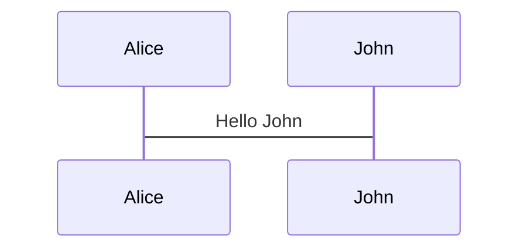
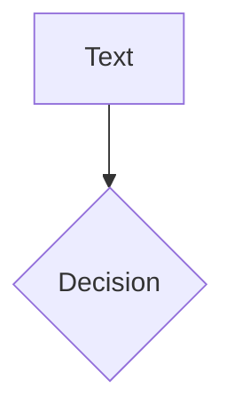
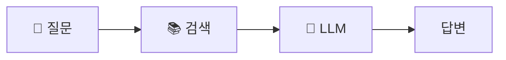

# Slidev Best Practices & Examples Reference

슬라이드 작성 전 **반드시** 이 문서와 참조 파일들을 읽고 패턴을 따를 것.

---

## 1. 필수 참조 파일

### 로컬 파일 (프로젝트 내)

| 파일 | 용도 | 참조 시점 |
|------|------|----------|
| `slidev/slides.md` | **공식 Starter Template** | 항상 먼저 참조 |
| `node_modules/@slidev/theme-{name}/example.md` | 테마별 레이아웃 사용법 | 테마 선택 후 |
| `docs/example-slides.md` | 기본 예시 | 필요시 |

### 온라인 리소스

| URL | 설명 |
|-----|------|
| [sli.dev/resources/showcases](https://sli.dev/resources/showcases) | 공식 Showcase 갤러리 |
| [github.com/antfu/talks](https://github.com/antfu/talks) | Anthony Fu의 발표들 (Slidev 창시자) |
| [github.com/slidevjs/slidev/demo/starter](https://github.com/slidevjs/slidev/blob/main/demo/starter/slides.md) | 공식 Starter 원본 |

---

## 2. 공식 Starter Template 핵심 패턴

### 2.1 Frontmatter 구조 (headmatter)

```yaml
---
theme: seriph
background: https://cover.sli.dev      # 배경 이미지 URL
title: Welcome to Slidev
info: |
  ## Slidev Starter Template
  Presentation slides for developers.
class: text-center                      # UnoCSS 클래스
transition: slide-left                  # 슬라이드 전환
mdc: true                               # MDC 문법 활성화
duration: 35min                         # 발표 시간
---
```

### 2.2 레이아웃 사용 예시

**표지 (cover)** - 첫 슬라이드 기본값:
```markdown
---
theme: seriph
background: https://cover.sli.dev
class: text-center
---

# Welcome to Slidev

Presentation slides for developers

<div class="abs-br m-6 text-xl">
  <a href="https://github.com/..." class="slidev-icon-btn">
    <carbon:logo-github />
  </a>
</div>
```

**two-cols 레이아웃**:
```markdown
---
layout: two-cols
layoutClass: gap-16
---

# Left Title

Content on left side

::right::

<Toc text-sm minDepth="1" maxDepth="2" />
```

**image-right 레이아웃**:
```markdown
---
layout: image-right
image: https://cover.sli.dev
---

# Code

Use code snippets and get the highlighting directly!

```ts {all|4|6|all} twoslash
import { computed, ref } from 'vue'
const count = ref(0)
```
```

**center 레이아웃** (마지막 슬라이드):
```markdown
---
layout: center
class: text-center
---

# Learn More

[Documentation](https://sli.dev) · [GitHub](https://github.com/slidevjs/slidev)

<PoweredBySlidev mt-10 />
```

### 2.3 애니메이션 패턴

**v-click 기본**:
```html

<p v-after class="absolute bottom-23 left-45 opacity-30 transform -rotate-10">Here!</p>
```

**v-mark 하이라이팅**:
```html
<span v-mark.red="3"><code>v-mark</code> directive</span>
<span v-mark.circle.orange="4">inline marks</span>
```

**v-motion 애니메이션**:
```html


<script setup lang="ts">
const final = {
  x: 0, y: 0, rotate: 0, scale: 1,
  transition: { type: 'spring', damping: 10, stiffness: 20, mass: 2 }
}
</script>
```

### 2.4 코드 블록 패턴

**순차 하이라이팅**:
````markdown
```ts {all|4|6|6-7|9|all} twoslash
// TwoSlash enables TypeScript hover information
import { computed, ref } from 'vue'

const count = ref(0)
const doubled = computed(() => count.value * 2)

doubled.value = 2
```
````

**Magic Move (코드 변환 애니메이션)**:
`````markdown
````md magic-move {lines: true}
```ts {*|2|*}
// step 1
const author = reactive({ name: 'John Doe' })
```

```ts {*|1-2|3-4}
// step 2
export default {
  data() { return { author: { name: 'John Doe' } } }
}
```
````
`````

**Monaco Editor (실행 가능 코드)**:
````markdown
```ts {monaco-run}
import { version } from 'vue'
console.log(`vue ${version}`)
```
````

### 2.5 다이어그램 패턴

**Mermaid 4열 배치**:
```markdown
<div class="grid grid-cols-4 gap-5 pt-4 -mb-6">





</div>
```

### 2.6 슬라이드별 스타일

```markdown
<style>
h1 {
  background-color: #2B90B6;
  background-image: linear-gradient(45deg, #4EC5D4 10%, #146b8c 20%);
  -webkit-background-clip: text;
  -webkit-text-fill-color: transparent;
}
</style>
```

---

## 3. Academic Theme 패턴

학술 발표용 `slidev-theme-academic` 사용법.

### 3.1 표지 (cover)

```yaml
---
theme: academic
layout: cover
coverAuthor: ['Author 1', 'Author 2']
coverAuthorUrl: ['https://author1.com', 'https://author2.com']
coverBackgroundUrl: /presentation.jpg
coverDate: '2025-12-11'
themeConfig:
  paginationX: r
  paginationY: t
  paginationPagesDisabled: [1]
---

# Presentation Title

## Subtitle
```

### 3.2 목차 (table-of-contents)

```yaml
---
layout: table-of-contents
hideInToc: false
---

# Table of Contents
```

### 3.3 그림 (figure)

```yaml
---
layout: figure
figureUrl: /images/result_chart.png
figureCaption: 'Figure 1: Performance Comparison'
figureFootnoteNumber: 1
---

# Results

<Footnotes separator>
  <Footnote :number=1>Data source: Experiment 2025</Footnote>
</Footnotes>
```

### 3.4 그림 + 텍스트 (figure-side)

```yaml
---
layout: figure-side
figureUrl: /images/architecture.png
figureCaption: 'System Architecture'
figureX: 'r'  # 이미지 오른쪽 배치 (l: 왼쪽)
---

# Architecture

- Component A handles...
- Component B processes...

<Footnotes separator>
  <Footnote :number=1>Reference</Footnote>
</Footnotes>
```

### 3.5 인덱스/참조 목록 (index)

```yaml
---
layout: index
indexEntries:
  - { title: 'Figure 1: Results', uri: 5 }
  - { title: 'Figure 2: Comparison', uri: 10 }
indexRedirectType: defined  # 내부 페이지
---

# List of Figures
```

```yaml
---
layout: index
indexEntries:
  - { title: 'GitHub Repository', uri: 'https://github.com/...' }
  - { title: 'Documentation', uri: 'https://docs.example.com' }
indexRedirectType: external  # 외부 링크
---

# References
```

---

## 4. Showcase 주요 발표 분석

### 4.1 KubeCon/기술 컨퍼런스 스타일

**특징**:
- 깔끔한 표지 + 배경 이미지
- 코드 중심 슬라이드
- Mermaid 아키텍처 다이어그램
- 이중 언어 지원 (한국어/영어)

**예시 리포지토리**:
- [github.com/nekomeowww/talks](https://github.com/nekomeowww/talks) - KubeCon 발표들
- [github.com/BaizeAI/talks](https://github.com/BaizeAI/talks) - AI/K8s 발표

### 4.2 학술 발표 스타일 (BRACIS 2023)

**특징**:
- `slidev-theme-academic` 사용
- 그림 캡션 + 각주
- 페이지네이션
- PDF 내보내기 중시

**예시 리포지토리**:
- [github.com/george-gca/bracis_2023_srcaps](https://github.com/george-gca/bracis_2023_srcaps)

### 4.3 Anthony Fu (Slidev 창시자) 스타일

**특징**:
- 풍부한 애니메이션 (v-motion, v-click)
- 커스텀 Vue 컴포넌트
- 그라데이션 제목 스타일
- 인터랙티브 요소

**예시 리포지토리**:
- [github.com/antfu/talks](https://github.com/antfu/talks)

---

## 5. 안티패턴 (하지 말 것)

### 5.1 레이아웃

```markdown
# ❌ 잘못된 예시: layout: none으로 수동 HTML

---
layout: none
---
<div class="w-full h-full flex flex-col justify-center items-center">
  <h1 class="text-4xl">제목</h1>
  ...30줄의 커스텀 HTML...
</div>

# ✅ 올바른 예시: 테마 레이아웃 사용

---
layout: cover
background: https://cover.sli.dev
class: text-center
---

# 제목
```

### 5.2 이미지

```markdown
# ❌ 잘못된 예시: 수동 grid + 작은 이미지

<div class="grid grid-cols-2 gap-8">
<div>텍스트</div>
<div>

</div>
</div>

# ✅ 올바른 예시: image-right 또는 figure 레이아웃

---
layout: image-right
image: /chart.png
backgroundSize: contain
---

# Title
- Point 1
- Point 2
```

### 5.3 통계/수치

```markdown
# ❌ 잘못된 예시: 테이블에 숫자 묻기

| 항목 | 값 |
|-----|-----|
| SemScore | 0.535 |
| 향상률 | +8.3% |

# ✅ 올바른 예시: fact 레이아웃으로 강조

---
layout: fact
---

# +8.3%
SemScore 향상 (Gemma vs GPT)
```

### 5.4 다이어그램

```markdown
# ❌ 잘못된 예시: ASCII 다이어그램

┌─────────────────────────────────────┐
│   👤 질문    →    📚 검색    →    🤖 LLM   │
└─────────────────────────────────────┘

# ✅ 올바른 예시: Mermaid 사용


```

---

## 6. 학술 발표 슬라이드 템플릿

석사/박사 심사용 15-20 슬라이드 구성:

```markdown
# 1. 표지 (cover)
---
layout: cover
coverAuthor: 설동헌
coverDate: '2025-12-11'
---
# 논문 제목

## 부제

---

# 2. 핵심 기여 (fact)
---
layout: fact
---
# +8.3%
완전 로컬 RAG가 상용 API 대비 SemScore 향상

---

# 3-4. 연구 배경/문제 (default)
---
# 연구 배경

<v-clicks>

- 문제점 1
- 문제점 2
- 연구 동기

</v-clicks>

---

# 5. RQ/가설 (two-cols)
---
layout: two-cols
---

## Research Questions

- RQ1: ...
- RQ2: ...

::right::

## Hypotheses

- H1: ...
- H2: ...

---

# 6-8. 방법론 (image-right, mermaid)
---
layout: image-right
image: /architecture.png
backgroundSize: contain
---

# 방법론

- 단계 1
- 단계 2

---

# 9-14. 결과 (figure, fact 반복)
---
layout: figure
figureUrl: /results.png
figureCaption: 'Table 1: 실험 결과'
---

# H1 검증 결과

---
layout: fact
---

# p < 0.001
통계적으로 유의함

---

# 15-16. 논의/한계 (default)
---
# 논의 및 한계

<v-clicks>

- 한계점 1
- 향후 연구

</v-clicks>

---

# 17. 결론/기여 (statement)
---
layout: statement
---

# 완전 로컬 RAG로 상용 API 수준 달성

---

# 18. 감사 (center)
---
layout: center
class: text-center
---

# 감사합니다

질문 있으시면 말씀해 주세요
```

---

## 7. 체크리스트

슬라이드 작성 전/후 확인:

### 작성 전
- [ ] `slidev/slidev/slides.md` (공식 Starter) 읽었는가?
- [ ] 사용할 테마의 `example.md` 읽었는가?
- [ ] 청중 수준에 맞는 내용 배분 계획했는가?

### 작성 중
- [ ] `layout: none` 대신 테마 레이아웃 사용하는가?
- [ ] 핵심 수치는 `layout: fact`로 강조하는가?
- [ ] 다이어그램은 Mermaid로 작성하는가?
- [ ] 이미지는 `image-right` 또는 `figure` 레이아웃인가?
- [ ] 애니메이션 (`v-click`, `v-motion`) 적절히 사용하는가?

### 작성 후
- [ ] PNG로 내보내 시각적 검토했는가?
- [ ] 텍스트/이미지 잘림 없는가?
- [ ] 레이아웃 다양성 있는가? (2열 반복 X)
- [ ] 핵심 메시지가 눈에 띄는가?
