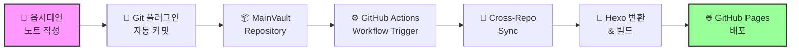

# 옵시디언을 활용한 자동 블로그 퍼블리싱 시스템 구축하기 🚀

## 들어가며: 왜 이 시스템이 필요한가?

옵시디언(Obsidian)은 강력한 노트 작성 도구지만, 이를 블로그로 퍼블리싱하려면 여러 수작업이 필요합니다. 매번 마크다운을 변환하고, 이미지를 옮기고, 형식을 맞추는 것은 번거로운 일이죠.

> [!tip] 💡 **이 시스템의 핵심 장점**
>
> - **원클릭 퍼블리싱**: 옵시디언에서 작성 → Git 푸시 → 자동 블로그 배포
> - **완전 자동화**: GitHub Actions가 모든 변환과 배포를 처리
> - **무료 호스팅**: GitHub Pages를 활용한 제로 코스트
> - **실시간 동기화**: 5분마다 자동 백업, 즉시 퍼블리싱

2025년 현재, 여러 정적 사이트 생성기 중 **Hexo**를 선택한 이유는 다음과 같습니다:

- Node.js 기반으로 확장성이 뛰어남
- 풍부한 플러그인 생태계
- 옵시디언 마크다운과의 호환성
- 한국어 콘텐츠 처리 최적화

## 시스템 아키텍처 개요

[🖼️ 이미지: 전체 시스템 아키텍처 다이어그램 - 옵시디언 → Git → GitHub Actions → Hexo → GitHub Pages 플로우]



### 핵심 구성 요소

1. **옵시디언 Git 플러그인**: 주기적 자동 백업
2. **MainVault Repository**: 원본 노트 저장소
3. **GitHub Actions Workflow**: 자동화 파이프라인
4. **변환 스크립트**: 옵시디언 → Hexo 마크다운 변환
5. **Hexo 빌드 시스템**: 정적 사이트 생성
6. **GitHub Pages**: 무료 호스팅

## 단계별 구축 가이드

### 1단계: 옵시디언 Git 플러그인 설정

[🖼️ 이미지: 옵시디언 Git 플러그인 설정 화면 캡처]

먼저 옵시디언에 Git 플러그인을 설치하고 설정합니다.

> [!note] 📌 **필수 설정 항목**
>
> - **Auto pull interval**: 5분 (자동 동기화)
> - **Auto commit and push interval**: 5분 (자동 백업)
> - **Commit message**: `vault backup: {{date}}`
> - **Pull on startup**: 활성화 (시작 시 동기화)

```bash
# Git 저장소 초기화 (터미널에서)
cd /path/to/your/vault
git init
git remote add origin https://github.com/yourusername/MainVault.git
git branch -M main
git push -u origin main
```

### 2단계: GitHub Actions 워크플로우 설정

MainVault 저장소에 `.github/workflows/sync-blog.yml` 파일을 생성합니다:

```yaml
name: Sync Blog to seolcoding.com

on:
  push:
    branches: [ main ]
    paths:
      - '50_publish/51_blog/**'  # 블로그 폴더만 감시
  workflow_dispatch:  # 수동 트리거 옵션

jobs:
  sync-blog:
    runs-on: ubuntu-latest

    steps:
    - name: Checkout MainVault (sparse)
      uses: actions/checkout@v4
      with:
        sparse-checkout: |
          50_publish/51_blog
        sparse-checkout-cone-mode: false
        path: mainvault

    - name: Checkout seolcoding.com
      uses: actions/checkout@v4
      with:
        repository: ${{ github.repository_owner }}/seolcoding.com
        token: ${{ secrets.SEOLCODING_TOKEN }}
        path: seolcoding

    - name: Sync raw content
      run: |
        # 마크다운 파일 복사
        mkdir -p seolcoding/temp-posts
        if [ -d "mainvault/50_publish/51_blog" ]; then
          cp mainvault/50_publish/51_blog/*.md seolcoding/temp-posts/ 2>/dev/null || echo "No markdown files to copy"
        fi

        # 첨부 파일 복사
        mkdir -p seolcoding/source/images
        if [ -d "mainvault/50_publish/51_blog/attachments" ]; then
          cp -r mainvault/50_publish/51_blog/attachments/* \
                seolcoding/source/images/ 2>/dev/null || echo "No attachments to copy"
        fi

    - name: Commit and Push to seolcoding.com
      run: |
        cd seolcoding
        git config user.name "github-actions[bot]"
        git config user.email "github-actions[bot]@users.noreply.github.com"

        git add .
        if git diff --staged --quiet; then
          echo "No changes to commit"
          exit 0
        else
          git commit -m "Sync blog posts from MainVault - $(date '+%Y-%m-%d %H:%M:%S')"
          git push
        fi

    - name: Trigger Hexo Build
      uses: peter-evans/repository-dispatch@v3
      with:
        token: ${{ secrets.SEOLCODING_TOKEN }}
        repository: ${{ github.repository_owner }}/seolcoding.com
        event-type: build-hexo
        client-payload: '{"ref": "${{ github.ref }}", "sha": "${{ github.sha }}"}'
```

> [!important] 🔐 **보안 설정**
> GitHub Settings → Secrets → Actions에서 `SEOLCODING_TOKEN`을 생성해야 합니다.
> Fine-grained personal access token을 사용하면 더 안전합니다.

### 3단계: 옵시디언-Hexo 변환 스크립트 구현

[🖼️ 이미지: 변환 전후 마크다운 비교 - WikiLinks, 이미지, 태그 변환 예시]

변환 스크립트의 핵심 기능들을 살펴보겠습니다:

```javascript
// convert-obsidian-to-hexo.js 핵심 변환 로직

/**
 * WikiLinks 변환: [[Page Name]] → [Page Name](page-name.html)
 */
function convertWikiLinks(content) {
  // 커스텀 텍스트가 있는 경우: [[Page Name|Custom Text]]
  content = content.replace(/\[\[([^\]|]+)\|([^\]]+)\]\]/g, (match, link, text) => {
    const slug = slugify(link);
    return `[${text}](../${slug}/)`;
  });

  // 단순 WikiLinks: [[Page Name]]
  content = content.replace(/\[\[([^\]]+)\]\]/g, (match, link) => {
    const slug = slugify(link);
    return `[${link}](../${slug}/)`;
  });

  return content;
}

/**
 * 이미지 변환: ![[image.png]] → 
 */
function convertImageLinks(content) {
  content = content.replace(/!\[\[([^\]]+)\]\]/g, (match, imagePath) => {
    return ``;
  });
  return content;
}

/**
 * YouTube 임베드 변환
 */
function convertYouTubeLinks(content) {
  // YouTube URL을 Hexo 임베드 태그로 변환
  content = content.replace(
    /!\[\]\((https?:\/\/(?:www\.)?youtube\.com\/watch\?v=([a-zA-Z0-9_-]+))\)/g,
    (match, fullUrl, videoId) => ``
  );
  return content;
}

/**
 * 해시태그를 Front Matter로 이동
 */
function extractHashtags(content, frontMatter) {
  const tagRegex = /#([a-zA-Z0-9_가-힣]+)/g;
  const tags = new Set(frontMatter.tags || []);
  let match;

  while ((match = tagRegex.exec(content)) !== null) {
    tags.add(match[1]);
  }

  return {
    content: content,
    tags: Array.from(tags)
  };
}
```

### 4단계: Hexo 빌드 및 배포 설정

블로그 저장소의 GitHub Actions 워크플로우 (`build-deploy.yml`):

```yaml
name: Build and Deploy Hexo

on:
  push:
    branches: [ main ]
  repository_dispatch:
    types: [build-hexo]
  workflow_dispatch:

jobs:
  build-deploy:
    runs-on: ubuntu-latest

    steps:
    - name: Checkout repository
      uses: actions/checkout@v4

    - name: Setup Node.js
      uses: actions/setup-node@v4
      with:
        node-version: '20'
        cache: 'npm'

    - name: Install dependencies
      run: npm ci

    - name: Convert Obsidian posts
      run: |
        if [ -d "temp-posts" ] && [ "$(ls -A temp-posts 2>/dev/null)" ]; then
          echo "Converting Obsidian posts to Hexo format..."
          node tools/convert-obsidian-to-hexo.js --input temp-posts --output source/_posts
          rm -rf temp-posts
        else
          echo "No new posts to convert"
        fi

    - name: Build Hexo site
      run: |
        npm run clean
        npm run build

    - name: Deploy to GitHub Pages
      uses: peaceiris/actions-gh-pages@v3
      with:
        github_token: ${{ secrets.GITHUB_TOKEN }}
        publish_dir: ./public
        publish_branch: gh-pages
        force_orphan: true
        cname: seolcoding.com  # 커스텀 도메인 사용 시
```

## 실제 사용법과 팁

### 글 작성 워크플로우

[🖼️ 이미지: 옵시디언에서 글 작성하는 화면 - 프론트매터, 태그, WikiLinks 포함]

1. **옵시디언에서 글 작성**

   ```markdown
   ---
   title: 나의 첫 블로그 포스트
   date: 2025-09-20
   tags: [블로그, 시작]
   categories: [Daily]
   ---

   # 제목

   오늘부터 블로그를 시작합니다!

   [[다른 포스트]]를 참고하세요.
   ![[screenshot.png]]

   #자동화 #블로그
   ```

2. **Git 자동 커밋** (5분마다 또는 수동으로)
   - Git 플러그인이 자동으로 커밋 & 푸시

3. **자동 변환 및 배포**
   - GitHub Actions가 감지하고 변환 시작
   - 약 2-3분 내에 블로그에 반영

### 폴더 구조 베스트 프랙티스

```
MainVault/
├── 00_inbox/          # 임시 노트
├── 10_projects/       # 진행 중인 프로젝트
├── 20_areas/          # 관심 영역
├── 50_publish/        # 퍼블리싱 콘텐츠
│   └── 51_blog/       # 블로그 포스트 ⭐
│       ├── 2025-09-20_first-post.md
│       └── attachments/
│           └── images/
└── 70_collections/    # 참고 자료
```

> [!tip] 💡 **프로 팁**
>
> - 날짜 접두사 사용: `YYYY-MM-DD_post-title.md`
> - 이미지는 `attachments/` 폴더에 정리
> - 드래프트는 `00_inbox/`에서 작성 후 이동

### 디버깅과 문제 해결

[🖼️ 이미지: GitHub Actions 실행 로그 화면 - 성공/실패 상태 확인]

**자주 발생하는 문제들:**

1. **WikiLinks 변환 오류**
   - 해결: 링크에 특수문자가 있는지 확인
   - 파일명에 `/`, `\`, `:` 등 사용 금지

2. **이미지가 표시되지 않음**
   - 해결: 이미지 경로 확인
   - `attachments/` 폴더 구조 유지

3. **GitHub Actions 실패**
   - 해결: Secrets 설정 확인
   - 저장소 권한 검토

## 고급 기능 확장

### 1. 자동 SEO 최적화

```javascript
// SEO 메타데이터 자동 생성
function generateSEOMeta(frontMatter, content) {
  if (!frontMatter.description) {
    // 첫 200자를 요약으로 사용
    frontMatter.description = content
      .replace(/[#*`\[\]]/g, '')
      .substring(0, 200)
      .trim() + '...';
  }

  if (!frontMatter.keywords) {
    frontMatter.keywords = frontMatter.tags.join(', ');
  }

  return frontMatter;
}
```

### 2. 댓글 시스템 통합

```yaml
# Front Matter에 추가
comments: true
disqus_shortname: your-blog-name
```

### 3. 검색 기능 추가

Hexo의 `hexo-generator-searchdb` 플러그인을 활용하면 로컬 검색 기능을 쉽게 구현할 수 있습니다.

## 성능 최적화 팁

> [!success] ⚡ **성능 최적화 체크리스트**
>
> - [ ] Sparse checkout으로 필요한 폴더만 동기화
> - [ ] 이미지 최적화 (WebP 변환 고려)
> - [ ] 캐싱 활용 (`actions/cache@v3`)
> - [ ] 병렬 처리로 빌드 시간 단축
> - [ ] CDN 활용 (Cloudflare Pages 연동)

## 비용 분석

| 항목 | 비용 | 설명 |
|-----|------|------|
| GitHub 저장소 | **무료** | Private 저장소 무제한 |
| GitHub Actions | **무료** | 월 2,000분 무료 (충분함) |
| GitHub Pages | **무료** | 정적 호스팅 |
| 커스텀 도메인 | 연 $10-15 | 선택사항 |
| **총 비용** | **$0/월** | 기본 구성 시 |

## 다른 정적 사이트 생성기와의 비교

[🖼️ 이미지: Hexo vs Hugo vs Jekyll 비교 차트 - 빌드 속도, 학습 곡선, 플러그인 생태계]

| 기능 | Hexo | Hugo | Jekyll |
|------|------|------|--------|
| **빌드 속도** | ⭐⭐⭐⭐ | ⭐⭐⭐⭐⭐ | ⭐⭐⭐ |
| **학습 곡선** | 쉬움 | 어려움 | 보통 |
| **플러그인** | 매우 많음 | 적음 | 많음 |
| **옵시디언 호환** | ⭐⭐⭐⭐⭐ | ⭐⭐⭐⭐ | ⭐⭐⭐ |
| **한국어 지원** | 우수 | 보통 | 우수 |

## 마치며: 이 시스템의 진정한 가치

이 자동화 시스템을 구축하면서 얻을 수 있는 가장 큰 가치는 **"쓰기에만 집중할 수 있는 환경"**입니다.

> [!quote] 💭 **핵심 메시지**
> "The best writing workflow is the one you don't have to think about."
>
> 최고의 글쓰기 워크플로우는 신경 쓸 필요가 없는 워크플로우입니다.

### 시스템 도입 전후 비교

**Before:**

- 마크다운 수동 변환 (10분)
- 이미지 경로 수정 (5분)
- Git 커밋 & 푸시 (2분)
- 빌드 & 배포 (5분)
- **총 22분/포스트**

**After:**

- 글 작성 완료
- 자동 처리 (백그라운드)
- **총 0분 추가 시간**

연간 100개 포스트 작성 시 **36시간 이상 절약**!

## 다음 단계: 더 나아가기

이 시스템을 구축한 후 고려해볼 수 있는 확장:

1. **AI 기반 자동 태깅**: GPT API를 활용한 자동 카테고리 분류
2. **다국어 지원**: i18n 플러그인으로 영문 버전 동시 관리
3. **통계 대시보드**: Google Analytics 연동 및 실시간 모니터링
4. **소셜 미디어 자동 공유**: Twitter, LinkedIn 자동 포스팅

---

**📚 참고 자료**

- [Obsidian Git Plugin 공식 문서](https://github.com/Vinzent03/obsidian-git)
- [Hexo 공식 가이드](https://hexo.io/docs/)
- [GitHub Actions 문서](https://docs.github.com/actions)

**🏷️ 태그:** #obsidian #hexo #github-actions #automation #blog #static-site-generator #cicd

---

*이 포스트가 도움이 되셨다면, GitHub에서 ⭐를 눌러주세요!*

*질문이나 개선 제안은 언제나 환영합니다. 댓글로 남겨주세요.*
