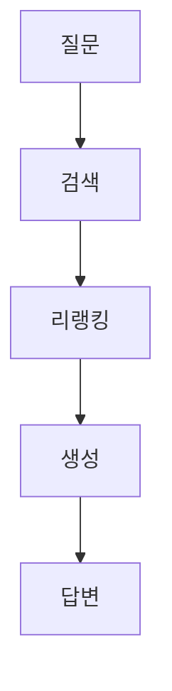

# RAG 파이프라인 최적화 연구
한국어 공공도메인 대상

<div class="absolute bottom-10">
연구자 | 2025-12-08
</div>

---

# 목차

<v-clicks>

- 연구 배경
- 실험 설계
- 주요 결과
- 결론 및 향후 과제

</v-clicks>

---
layout: section
---

# 1. 연구 배경

---

# 문제 정의

<v-clicks>

- 공공기관의 LLM 도입 제약
  - 데이터 보안 이슈
  - API 비용 문제
- On-premise 환경 필요
  - 24GB VRAM 제약
  - 오픈소스 LLM 활용

</v-clicks>

---
layout: two-cols
---

# 연구 질문

<v-clicks>

- RQ1: 오픈소스 LLM 성능?
- RQ2: 최적 검색 전략?
- RQ3: 리랭커 효과?

</v-clicks>

::right::



---
layout: section
---

# 2. 실험 설계

---

# 데이터셋

<v-clicks>

| Component | Count |
|-----------|-------|
| QA Pairs | 180 |
| Corpus | 5,000 |
| Answer:Distractor | 1:23.5 |

</v-clicks>

---

# 파이프라인

```python {1|2-3|4-5|all}
# RAG Pipeline
query = "질문 텍스트"
docs = retriever.search(query, top_k=10)
docs = reranker.rerank(query, docs, top_k=3)
answer = generator.generate(query, docs)
```

---
layout: section
---

# 3. 주요 결과

---
layout: fact
---

# 0.89
EXAONE-3.5 SemScore

---
layout: quote
---

# "On-premise 오픈소스 LLM이 상용 API 대비 동등 이상의 성능 달성"

---
layout: center
---

# 감사합니다

질문 및 토론 환영합니다
