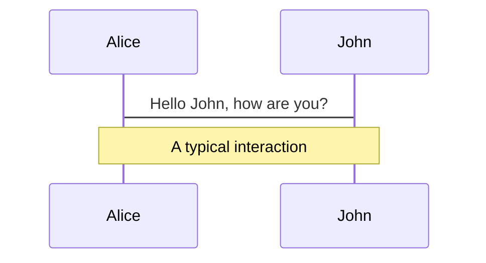
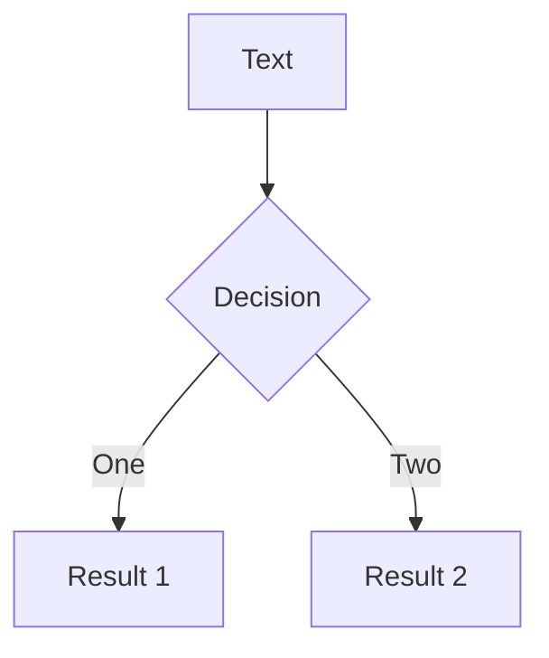

yntax Guide
Slidev's slides are written as Markdown files, which are called Slidev Markdowns. A presentation has a Slidev Markdown as its entry, which is ./slides.md by default, but you can change it by passing the file path as an argument to the CLI commands.

In a Slidev Markdown, not only the basic Markdown features can be used as usual, Slidev also provides additional features to enhance your slides. This section covers the syntax introduced by Slidev. Please make sure you know the basic Markdown syntax before reading this guide.

Slide Separators
Use --- padded with a new line to separate your slides.

# Title

Hello, **Slidev**!

---

# Slide 2

Use code blocks for highlighting:

```ts
console.log("Hello, World!");
```

---

# Slide 3

Use UnoCSS classes and Vue components to style and enrich your slides:

<div class="p-3">
  <Tweet id="..." />
</div>
Frontmatter & Headmatter
At the beginning of each slide, you can add an optional frontmatter to configure the slide. The first frontmatter block is called headmatter and can configure the whole slide deck. The rest are frontmatters for individual slides. Texts in the headmatter or the frontmatter should be an object in YAML format. For example:

---

theme: seriph
title: Welcome to Slidev

---

# Slide 1

The frontmatter of this slide is also the headmatter

---

layout: center
background: /background-1.png
class: text-white

---

# Slide 2

A page with the layout `center` and a background image

---

# Slide 3

A page without frontmatter

---

## src: ./pages/4.md # This slide only contains a frontmatter

---

# Slide 5

Configurations you can set are described in the Slides deck configurations and Per slide configurations sections.

To make the headmatter more readable, you can install the VSCode extension:

✨ VS Code Extension
✨ VS Code Extension
Help you better organize your slides and have a quick overview of them.
Also, there is another possible frontmatter format:

✨ Block Frontmatter
✨ Block Frontmatter
Use a YAML code block as the frontmatter.
Notes
You can also create presenter notes for each slide. They will show up in 📖 User Interface📖 User Interface for you to reference during presentations.

The comment blocks at the end of each slide are treated as the note of the slide:

---

## layout: cover

# Slide 1

This is the cover page.

<!-- This is a **note** -->

---

# Slide 2

<!-- This is NOT a note because it is not at the end of the slide -->

The second page

<!--
This is _another_ note
-->

Basic Markdown and HTML are also supported in notes and will be rendered.

See also:
✨ Click Markers
✨ Click Markers
Highlighting notes and auto-scrolling to the active section of notes.
Code Blocks
One big reason that led to the creation of Slidev was the need to perfectly display code in slides. Consequently, you can use Markdown-flavored code blocks to highlight your code.

```ts
console.log("Hello, World!");
```

Slidev has Shiki built in as the syntax highlighter. Refer to Configure Shiki for more details.

More about code blocks:

✨ Line Numbers
✨ Line Numbers
Enable line numbering for all code blocks across the slides or individually.
✨ Max Height
✨ Max Height
Set a maximum height for a code block and enable scrolling.
✨ Line Highlighting
✨ Line Highlighting
Highlight specific lines in code blocks based on clicks.
✨ Monaco Editor
✨ Monaco Editor
Turn code blocks into fully-featured editors, or generate a diff between two code blocks.
✨ Monaco Runner
✨ Monaco Runner
Run code directly in the editor and see the result.
✨ Writable Monaco Editor
✨ Writable Monaco Editor
A monaco editor that allows you to write code directly in the slides and save the changes back to the file.
✨ Shiki Magic Move
✨ Shiki Magic Move
Enable granular transition between code changes, similar to Keynote's Magic Move.
✨ TwoSlash Integration
✨ TwoSlash Integration
A powerful tool for rendering TypeScript code blocks with type information on hover or inlined.
✨ Import Code Snippets
✨ Import Code Snippets
Import code snippets from existing files into your slides.
✨ Code Groups
✨ Code Groups
Group multiple code blocks and automatically match icon by the title name.
LaTeX Blocks
Slidev supports LaTeX blocks for mathematical and chemical formulas:

✨ LaTeX
✨ LaTeX
Slidev comes with LaTeX support out-of-box, powered by KaTeX.
Diagrams
Slidev supports Mermaid and PlantUML for creating diagrams from text:

✨ Mermaid Diagrams
✨ Mermaid Diagrams
Create diagrams/graphs from textual descriptions, powered by Mermaid.
✨ PlantUML Diagrams
✨ PlantUML Diagrams
Create diagrams from textual descriptions, powered by PlantUML.
MDC Syntax
MDC Syntax is the easiest way to apply styles and classes to elements:

✨ MDC Syntax
✨ MDC Syntax
A powerful syntax to enhance your markdown content with components and styles.
Scoped CSS
You can use scoped CSS to style your slides:

✨ Slide Scope Styles
✨ Slide Scope Styles
Define styles for only the current slide.
Importing Slides
✨ Importing Slides
✨ Importing Slides
Split your `slides.md` into multiple files for better reusability and organization.

Line Numbers
You can enable line numbering for all code blocks across the slides by setting lineNumbers: true in the headmatter, or enable each code block individually by setting lines: true.

You can also set the starting line for each code block and highlight the lines accordingly via {startLine: number}, which defaults to 1.

```ts {6,7}{lines:true,startLine:5}
function add(a: Ref<number> | number, b: Ref<number> | number) {
  return computed(() => unref(a) + unref(b));
}
```

Note that you can use {\*} as a placeholder of ✨ Line Highlighting✨ Line Highlighting:

```ts {*}{lines:true,startLine:5}
// ...
```

Max Height
If the code doesn't fit into one slide, you use the maxHeight to set a fixed height and enable scrolling:

```ts {2|3|7|12}{maxHeight:'100px'}
function add(a: Ref<number> | number, b: Ref<number> | number) {
  return computed(() => unref(a) + unref(b));
}
/// ...as many lines as you want
const c = add(1, 2);
```

Note that you can use {\*} as a placeholder of ✨ Line Highlighting✨ Line Highlighting:

```ts {*}{maxHeight:'100px'}
// ...
```

Line Highlighting
To highlight specific lines, simply add line numbers within brackets {}. Line numbers start counting from 1 by default.

```ts {2,3}
function add(a: Ref<number> | number, b: Ref<number> | number) {
  return computed(() => unref(a) + unref(b));
}
```

Dynamic Line Highlighting
To change what's highlighted with multiple clicks, you can use | to separate each stage:

```ts {2-3|5|all}
function add(a: Ref<number> | number, b: Ref<number> | number) {
  return computed(() => unref(a) + unref(b));
}
```

This will first highlight a: Ref<number> | number and b: Ref<number> | number, and then return computed(() => unref(a) + unref(b)) after one click, and lastly, the whole block.

You can set the line number to hide to hide the code block or none to not highlight any line:

```ts {hide|none}
function add(a: Ref<number> | number, b: Ref<number> | number) {
  return computed(() => unref(a) + unref(b));
}
```

TIP

Learn more in the click animations guide.

Monaco Editor

Whenever you want to do some modification in the presentation, simply add {monaco} after the language id — it turns the block into a fully-featured Monaco editor!

```ts {monaco}
console.log("HelloWorld");
```

Learn more about Configuring Monaco.

Diff Editor
Monaco can also generate a diff between two code blocks. Use {monaco-diff} to turn the block into a Monaco diff editor and use ~~~ to separate the original and modified code!

```ts {monaco-diff}
console.log("Original text");
~~~console.log("Modified text");
```

Editor Height
By default, the Monaco editor has a fixed height based on the initial content. If you start with an empty or small code block and want the editor to automatically grow as you type more code, you can set {height:'auto'}.

```ts {monaco} {height:'auto'}
// The editor will automatically grow as you type more code
console.log("Hello, World!");
```

You can also set a specific height using CSS units like {height:'300px'} or {height:'100%'}.

Monaco Runner
Slidev also provides the Monaco Runner Editor, which allows you to run the code directly in the editor and see the result. Use {monaco-run} to turn the block into a Monaco Runner Editor.

```ts {monaco-run}
function distance(x: number, y: number) {
  return Math.sqrt(x ** 2 + y ** 2);
}
console.log(distance(3, 4));
```

It provides the editor with a "Run" button, and shows the result of the code execution right below the code block. You may also modify the code and the result will be re-evaluated on the fly.

By default it will automatically run the code when the slide is loaded; if you want to instead explicitly trigger the run, you can set {autorun:false}.

```ts {monaco-run} {autorun:false}
console.log("Click the play button to run me");
```

If you want to only show the output in certain clicks, you can use the showOutputAt prop. The value is the same as v-click.

```ts {monaco-run} {showOutputAt:'+1'}
console.log("Shown after 1 click");
```

Currently, Slidev supports running JavaScript and TypeScript code out-of-box. Refer to Custom Code Runners for custom language support.

Shiki Magic Move
Shiki Magic Move enables you to have a granular transition between code changes, similar to Keynote's Magic Move. You can check the playground to see how it works.

In Slidev, we bind the magic-move to the clicks system. The syntax is to wrap multiple code blocks representing each step with ````md magic-move (mind it's 4 backticks), this will be transformed into one code block, that morphs to each step as you click.

````md magic-move
```js
console.log(`Step ${1}`);
```

```js
console.log(`Step ${1 + 1}`);
```

```ts
console.log(`Step ${3}` as string);
```
````

It's also possible to mix Magic Move with ✨ Line Highlighting✨ Line Highlighting and ✨ Line Numbers✨ Line Numbers, for example:

````md magic-move {at:4, lines: true} // [!code hl]
```js {*|1|2-5} // [!code hl]
let count = 1;
function add() {
  count++;
}
```

Non-code blocks in between as ignored, you can put some comments.

```js {*}{lines: false} // [!code hl]
let count = 1;
const add = () => (count += 1);
```
````

woSlash Integration
TwoSlash is a powerful tool for rendering TypeScript code blocks with type information on hover or inlined. It's quite useful for preparing slides for JavaScript/TypeScript-related topics.

To use it, you can add twoslash to the code block's language identifier:

```ts twoslash
import { ref } from "vue";

const count = ref(0);
//            ^?
```

It will be rendered as:

import { ref } from 'vue'

const count = ref(0)

Mermaid Diagrams
You can also create diagrams/graphs from textual descriptions in your Markdown, powered by Mermaid.

Code blocks marked as mermaid will be converted to diagrams, for example:



You can further pass an options object to it to specify the scaling and theming. The syntax of the object is a JavaScript object literal, you will need to add quotes (') for strings and use comma (,) between keys.



Visit the Mermaid Website for more information.

Importing Slides
You can split your slides.md into multiple files for better reusability and organization. To do this, you can use the src frontmatter option to specify the path to the external markdown file. For example:

./slides.md

./pages/toc.md

# Title

This is a normal page

---

## src: ./pages/toc.md // [!code highlight]

<!-- this page will be loaded from './pages/toc.md' -->

Contents here are ignored

---

# Page 4

Another normal page

---

## src: ./pages/toc.md # Reuse the same file // [!code highlight]

Importing Specific Slides
To reuse some of the slides inside another Markdown file, you can use the hash part of the import path:

---

## src: ./another-presentation.md#2,5-7

This will import the slides 2, 5, 6, and 7 from ./another-presentation.md.

Frontmatter Merging
✨ Frontmatter Merging
✨ Frontmatter Merging
Merge frontmatter from multiple markdown files.

Slide Scope Styles
You can use the <style> tag in your Markdown to define styles for only the current slide.

# This is Red

<style>
h1 {
  color: red;
}
</style>

---

# Other slides are not affected

The <style> tag in Markdown is always scoped. As a result, a selector with a child combinator (.a > .b) is unusable as such; see the previous link. To have global styles, check out the customization section.

Powered by UnoCSS, you can directly use nested css and directives:

# Slidev

> Hello **world**

<style>
blockquote {
  strong {
    --uno: 'text-teal-500 dark:text-teal-400';
  }
}
</style>
